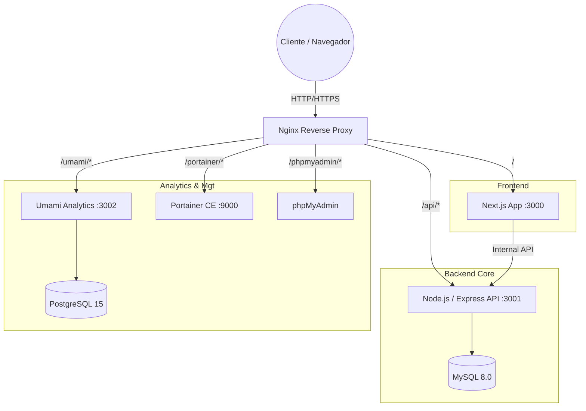
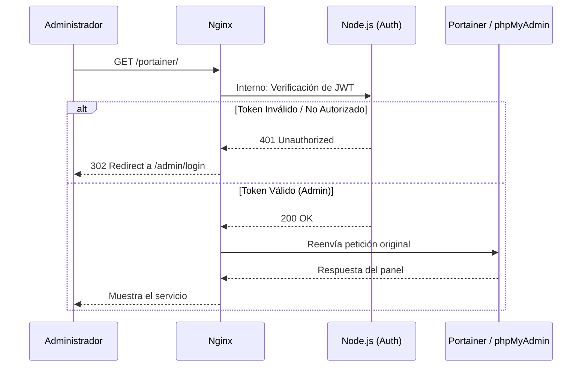

# Fernet Los Horneros - Documentación Técnica y Arquitectura

Esta documentación detalla la arquitectura de backend, infraestructura y servicios subyacentes que dan vida a la plataforma de **Fernet Los Horneros**. Está orientada a desarrolladores y administradores de sistemas que necesiten comprender el funcionamiento interno del proyecto.

## Arquitectura General

El proyecto utiliza una arquitectura de microservicios contenerizados gestionados mediante **Docker** y **Docker Compose**. Todo el tráfico entra a través de un servidor proxy inverso (**Nginx**), el cual se encarga del enrutamiento de peticiones, la terminación SSL y la seguridad.

## Servicios e Infraestructura (Docker)

El entorno de producción se levanta mediante `docker-compose.prod.yml`, que orquesta los siguientes contenedores en una red unificada (`app_network`):

1. **Backend (`backend_fernet_prod`)**: 
   Servidor de API en Node.js que procesa toda la lógica de negocio.
2. **Frontend (`frontend_prod`)**: 
   Aplicación Next.js que consume la API del backend.
3. **Nginx (`nginx_prod`)**: 
   Expone los puertos 80 y 443. Maneja certificados SSL y rutas.
4. **Base de Datos (`db_fernetloshorneros`)**: 
   MySQL 8.0 para el sistema principal (productos, órdenes, usuarios).
5. **phpMyAdmin (`phpmyadmin_prod`)**: 
   Interfaz gráfica para administrar la base de datos MySQL.
6. **Portainer (`portainer_prod`)**: 
   Plataforma de gestión de contenedores Docker mediante una interfaz web.
7. **Umami Analytics (`umami_prod` & `umami_db_prod`)**: 
   Alternativa a Google Analytics, auto-alojada y respetuosa con la privacidad. Utiliza su propia base de datos PostgreSQL.

### Flujo de Enrutamiento y Seguridad (Nginx)

Nginx actúa como el único punto de entrada. Cuenta con optimización de buffers para servir archivos eficientemente y previene ataques de denegación de servicio (DDoS) mediante `limit_req_zone` para la API.

Una de las características clave de seguridad es el **Auth Subrequest**. Las rutas sensibles como `/portainer/` y `/phpmyadmin/` están protegidas por Nginx haciendo una sub-petición (`auth_request /_auth_admin`) al backend Node.js. Si el administrador no tiene una sesión válida, Nginx intercepta el error 401 y redirige automáticamente al login del frontend.

## Backend (Node.js & Express)

El backend está construido con **TypeScript**, **Express** y **Sequelize** (ORM).

### Características y Funcionalidades Principales

- **Gestión de Órdenes y Pagos (`/payments`, `/orders`)**: Integración robusta con la pasarela de pagos de MercadoPago. El backend se encarga de crear las preferencias de pago, manejar los webhooks y actualizar los estados de las órdenes de manera segura.
- **Limpieza Automática (Cron Jobs)**:
  - Un proceso en segundo plano (usando `setInterval` cada minuto) que limpia y libera stock de carritos abandonados o pagos no completados (`cleanupExpiredOrders`).
  - Uso de `node-cron` para realizar copias de seguridad de la base de datos MySQL (vía `mysqldump`) automáticamente todos los días a las 3:00 AM.
- **Sistema de Archivos y Subidas (`/uploads`)**:
  - Utiliza `multer` para la carga segura de imágenes de productos y comprobantes, almacenados en un volumen persistente mapeado en Docker, expuesto directamente a través de Nginx por razones de rendimiento.
- **Gestión de Envíos (`/shipping`)**: Integración con servicios de logística (Zipnova).
- **Gestión de Producción y Lotes (`/produccion`, `/lotes`)**: Endpoints dedicados para administrar el stock real, la fabricación del fernet y la trazabilidad de los lotes.
- **Autenticación (`/admin`)**: Sistema basado en JWT para los administradores, que también respalda la protección a nivel de Nginx.

### Integración de Correo Transaccional (Resend / SMTP)

El envío de correos electrónicos transaccionales (confirmaciones de órdenes, tickets, notificaciones a usuarios, etc.) está impulsado por **Nodemailer**, el cual está configurado para utilizar los servidores SMTP de **Resend**.

- **Plantillas Dinámicas (`/email-templates`)**: El backend cuenta con un sistema de plantillas que pueden ser gestionadas. Se inyectan las variables (como total de la orden, nombre, dirección) justo antes de enviar el correo a través del túnel seguro de Resend.

## Monitorización y Analíticas

- **Umami**: El despliegue incluye Umami para rastrear visitas, eventos de conversión y tráfico de red de la landing page. Al estar alojado en la misma red, asegura que los datos no viajen a servicios de terceros, manteniendo la privacidad.
- **Portainer**: Permite inspeccionar en tiempo real los logs del backend o frontend, gestionar volúmenes (como `mysql_data` o `uploads`), y reiniciar servicios sin necesidad de entrar a la consola del servidor por SSH.

---

## Funcionalidades y Panel de Control (Visión General)

El panel de administración (accesible desde `/admin`) es el centro de operaciones. Está protegido con JWT y permite gestionar integralmente el ciclo de vida del negocio.

### Secciones del Panel de Administración

1. **Productos (`/admin/productos`)**:
   - Creación, edición y eliminación de productos (ej. Fernet, merchandising).
   - Control de precios, descripciones y subida de imágenes (vía `multer` al volumen `uploads`).
   - Gestión rápida del stock disponible de cara a la tienda pública.
2. **Pedidos (`/admin/pedidos`)**:
   - Listado completo de todas las órdenes de los clientes.
   - Detalle de cada pedido: datos del comprador, estado del pago (Aprobado, Pendiente, Rechazado) y método de envío.
   - Posibilidad de cambiar estados, ver comprobantes y procesar la logística.
3. **Producción y Lotes (`/admin/produccion` & `/admin/lotes`)**:
   - **Lotes**: Control de la trazabilidad del fernet. Permite registrar cuándo se inició un lote, su estado de maduración y cuándo está listo.
   - **Producción**: Gestión del stock real (botellas, etiquetas, insumos) contra el stock virtual vendido.
4. **Lista de Espera (`/admin/lista-espera`)**:
   - Visualización de usuarios que se han suscrito para recibir novedades o acceso temprano cuando no hay stock general.
5. **Analytics (`/admin/analytics`)**:
   - Acceso directo a las métricas del sitio (provistas por Umami) para medir conversiones, visitas por página y rendimiento de campañas.
6. **Cupones (`/admin/cupones`)**:
   - Creación de códigos de descuento.
   - Configuración de reglas: porcentaje de descuento, monto fijo, límite de usos y fechas de expiración.
7. **Emails (`/admin/emails`)**:
   - Gestor de plantillas dinámicas.
   - Permite editar el asunto y el cuerpo (con variables como `{{nombre}}` o `{{total}}`) de los correos que el sistema envía automáticamente (compras, confirmaciones).
8. **Configuración (`/admin/config`)**:
   - **Modo Mantenimiento**: Activar/desactivar el sitio al público con un solo clic (redirige a `/mantenimiento`).
   - Configuración de IPs permitidas (whitelisting) para que los administradores puedan ver el sitio aunque esté en mantenimiento.
   - Variables globales del negocio.

### Herramientas Externas en el Panel
Desde el menú lateral del admin, hay accesos directos autenticados a:
- **phpMyAdmin**: Para inspeccionar directamente tablas y relaciones de la base de datos.
- **Portainer**: Para revisar logs de contenedores si ocurre un error, reiniciar servicios o ver el uso de recursos.
- **Resend**: Enlace externo al panel de correos para ver el historial de entregabilidad, rebotes y métricas de email.

---

## Flujo de Compra (Checkout) y Lógica por Detrás

El proceso de compra en la tienda pública (ruta `/cart` y `/payment`) está diseñado para ser fluido y seguro:

1. **Carrito y Resumen (`/cart`)**:
   - El usuario visualiza los productos añadidos, ajusta cantidades y ve el subtotal.
   - Se valida el stock en tiempo real consultando al backend.

2. **Carga de Datos y Envíos**:
   - **Formulario de Cliente**: Recolección de Email, DNI/CUIL, Nombre y Teléfono.
   - **Logística (Zipnova)**: El cliente ingresa su Código Postal. El frontend envía la petición al backend (`/shipping`), que a su vez se comunica con la API de Zipnova para cotizar en tiempo real el costo de envío o definir opciones de retiro (ej. Andreani, retiro en sucursal).
   - **Cupones**: Un campo permite aplicar un código de descuento; el backend valida si está activo y recalcula el total.

3. **Reserva de Stock y Preferencia de Pago**:
   - Al confirmar los datos, el backend crea el pedido en estado "Pendiente".
   - **Bloqueo temporal**: Reserva el stock para evitar sobreventas. (Si el usuario abandona el carrito, el *Cron Job* de limpieza que corre cada minuto liberará este stock tras expirar el tiempo prudencial).
   - El backend genera una **Preferencia de Pago** contra la API de MercadoPago, obteniendo un link seguro (`init_point`).

4. **Procesamiento (MercadoPago)**:
   - El usuario es redirigido a MercadoPago, donde ingresa su tarjeta o dinero en cuenta.
   - MercadoPago procesa la transacción y envía silenciosamente una petición asíncrona (**Webhook**) al backend (`/payments/webhook`).

5. **Resolución y Notificaciones (`/payment/success` | `failure` | `pending`)**:
   - El webhook del backend intercepta el pago, valida la firma, y actualiza el estado del pedido en la base de datos a "Aprobado".
   - Dispara el envío automático del **Email Transaccional** (vía Resend/Nodemailer) avisándole al cliente que su compra fue exitosa, inyectando los detalles del pedido en la plantilla correspondiente.
   - El usuario es redirigido de vuelta a la página de éxito de la tienda, visualizando su número de pedido y los pasos a seguir.